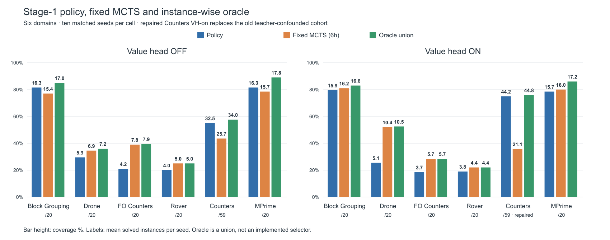

# Scientific and cluster follow-up — 4 October2026

Scientific capture **11:43:02IDT**; verified queue **12:02:29IDT**. Fresh storage
and final diagnostic cleanup have separate stamped receipts in the packet.
[Evidence/CSV navigation](README.md).
Prior reports remain immutable dated observations, not current queue authority.

## 1. Annotation answers

### Exact tests and global Holm: why no rejection is possible here

Each paired test has ten seed differences. Under the exact two-sided sign-flip
test there are2^10=1024 equally counted sign assignments. Even the most extreme
possible observed arrangement has its all-positive and all-negative extremes:
minimum p=2/1024=.001953125. Holm's first threshold for52 tests is
.05/52=.000961538. Thus even the minimum possible p cannot pass the first
threshold; its first adjusted value is52×.001953125=.1015625. Holm stops without
rejecting any hypothesis. This is a resolution limitation of this exact test
and family, **not evidence of equivalence or no effect**. We still report effect
sizes, paired wins/losses, raw p and the common adjusted p. Changing the family
after seeing results merely to manufacture significance is not justified.
The four repaired Counters contrasts are included with the others, not separately
corrected. :codex-annotation{index="1"}

### Current oracle and partial repaired Stage2

The regenerated plot uses repaired teacher-correct Counters-on: policy44.2,
fixed-MCTS21.1, exact oracle44.8/59. All36 bars have numeric labels; the two
requested footer rows are removed. Eleven other cells retain their actually
executed historical configurations. This is a disclosed mixed-cohort **Stage1**
oracle, not an implemented selector or Stage2 oracle. The old confounded
Counters-on observations remain only as separate historical evidence.

RepairedS2 fixed is **29.7/31.9/32.0*** at30m/2h/6h with510/590 terminal
records; PW is **30.4/31.7/32.1*** with531/590. These partial counts are observed
successes divided by ten target seeds; absent positions are unscored, not losses.
No ≥ sign is used; the asterisk and denominator are mandatory. :codex-annotation{index="2"}

### Exploratory axes, full domain statistics and clean release

All17 axes and completed K10/HER/other screens are documented in the
[cross-linked axes report](EXPLORATORY_AXES.md),
configuration_axes.csv, same-seed score tables, gained/lost memberships and
non-expansion decisions. Positive cells are retained. FO-off K10 PW14/6 fails
the second-seed≥8 gate; no five-seed expansion is submitted.
:codex-annotation{index="3"}

The full structural census now has159/159 native parsed problems, actual grounded
actions, propositions/fluents/comparisons, projected state-space formulas and
limits, behavioral statistics and primary-paper classifications. It is not
merely a successful-plan-length table. **Rover**, not Counters, had near-universal
finite h=0 in the V2 non-goal sample; native recharge-cost versus action-length
units explain why this is possible. See the
[full statistics report](DOMAIN_STATISTICS.md).
:codex-annotation{index="4"}

The clean artifacts repository receives a new dated six-domain evidence release,
offline statistics replay and explicit-hash evaluation entrypoints, while retaining
the original legacy bundle. It does not pretend its65 legacy bundled weights
are all240 current endpoint networks. Publication/test receipts and final Git
revision are recorded in the packet. :codex-annotation{index="5"}

### What the four dependent maintenance jobs actually do

|Job|Action after parents terminate|Can submit scientific work?|
|---|---|---|
|21955705|Merge Drone/FO-S2/Counters-off-S2 intended ledgers|No|
|21955994|Merge FO-S1 exact-position ledger|No|
|21947252|Write repaired selected-Counters task/instance/residual ledgers|No|
|21990151|Check repairedS2 parents, frozen inputs and exact terminal identities|Yes: only genuinely absent exact tails, followed by their collector|

The guard does not retrain, expand configurations or repeat known successes/
six-hour timeouts. It preserves weights, original effective RNG, dataset and
estimator configuration; its possible tails are one-worker4CPU64GiB8h at%8.
The deployed scripts and dependency relationships were inspected directly.
All four currently wait on dependencies; nothing warrants duplicate collectors.
:codex-annotation{index="6"}

### Changes from the preceding live snapshot

|Population|Previous|Current|Change|
|---|---:|---:|---:|
|Drone intended|452/800|502/800|+50|
|FO intendedS1|361/400|362/400|+1|
|FO intendedS2|171/400|178/400|+7|
|Counters intendedS2-off|466/590|478/590|+12|
|RepairedCountersS2 durable fixed/PW|1026/1180|1041/1180|+15|
|RepairedCountersS2 complete endpoints|10/20|11/20|+1|

All1202 new intended records pass identity/hash/RNG/configuration/runtime checks.
Historical6360/6360, recovery110/110, V212000/12000 and paid-for side arms remain
complete. No new scientific evaluation or training was submitted this turn.
One freed192GiB parent allowed existing FO-S2 concurrency22→24, verified in Slurm.

## 2. Cluster workload and measured estimates

Queue12:02:29: **63 scientific jobs running**,270CPUs,6080GiB allocated;
**45 pending**,168CPUs,3020GiB requested; **zero user-held**. The separate
2CPU/8GiB diagnostic allocation is temporary and canceled before final reply.
Pending RAM is not simultaneous usage. Current scientific pending reasons are
array concurrency; four maintenance jobs wait on dependencies.

|Experiment|Running/pending|Allocated CPU/GiB|Pending CPU/GiB|Bounds and measured remaining information|
|---|---|---|---|---|
|Drone intended21955700|18/22|72/1152|88/1408|72h groups,6h/instance; pooled≈16.6h at18 workers|
|FO S2 intended21955702|24/8|96/2304|32/768|72h groups,6h/instance; pooled≈31.2h at24|
|Counters offS2 intended21955704|8/7|32/512|28/448|72h groups,6h/instance; pooled≈14.6h at8|
|FO S1 exact21955993|4/4|16/384|16/384|72h groups; active8.5–35.7h,38 positions remain|
|RepairedCountersS2 fixed/PW|9/0|54/1728|0/0|72h; active27.6–53.9h; guard covers true tails|
|Three collectors+one guard|0/4|0/0|4/12|1h maintenance jobs; dependency-bound|

Pooled projections include startup and elapsed active/complete workers, not just
quick successes. They are conditional execution forecasts, not start promises.
Hard residuals, serial group packing, queue delay and operational failures can
extend them. All-remaining-six-hour fluid stresses are99.3/55.5/84h for
Drone/FO-S2/Counters-off-S2. Working closure windowOct5–8; exact tailsOct9–12.
FO-S1 and repairedS2 remain long-running groups; deadline ranges do not supply
a reliable expected finish time. Current accounting has no new FAILED/OOM/
NODE_FAIL/TIMEOUT that requires an additional recovery submission.

All-family simultaneous maximum is6100GiB including8 diagnostic+12 maintenance,
below6144 by44GiB. Useful capacity is occupied without wasting RAM on new filler.
Fresh full-home usage/headroom is in storage_measurement_compute.json;400GiB
is the working ceiling, not a newly verified site quota.

## 3. All-stage comparison, RQs, V2 and oracle

Means per seed; /20 except Counters/59. Search columns are30m/2h/6h. Ten seeds
per complete cell. All searches use their same-checkpoint policy comparator.
† S2 training used a historical leaf differing from intended; policy remains a
real observation. * is unfinished repaired search, with explicit coverage above.

|Domain/VH|S1 policy|S1 fixed|S2 policy|S2 fixed|
|---|---:|---|---:|---|
|BG off|16.3|11.6/14.8/15.4|16.0|11.4/15.0/15.7|
|BG on|15.9|12.0/14.0/16.2|12.8|10.1/10.6/12.6|
|Drone off|5.9|6.9/6.9/6.9|6.7†|7.5/7.7/7.7|
|Drone on|5.1|10.0/10.4/10.4|5.0†|10.9/11.2/11.2|
|FO off|4.2|7.5/7.8/7.8|2.9†|6.1/6.1/6.1|
|FO on|3.7|5.3/5.7/5.7|3.1†|5.2/5.4/5.4|
|Rover off|4.0|4.8/5.0/5.0|4.0|4.5/4.5/4.5|
|Rover on|3.8|4.4/4.4/4.4|3.9|4.4/4.5/4.5|
|Counters off|32.5|24.9/25.6/25.7|36.9†|34.9/36.7/36.7|
|Counters repaired on|44.2|20.2/20.5/21.1|33.5|29.7/31.9/32.0*|
|MPrime off|16.3|13.0/14.7/15.7|16.5|14.2/15.8/16.6|
|MPrime on|15.7|13.3/15.1/16.0|16.7|12.9/14.6/16.0|

Historical actual estimator labels are in section6. MPrimeS2 PW17.9off/17.2on
is complete. RepairedCountersS2 PW30.4/31.7/32.1* is partial. The old
teacher-confounded Counters-on scores remain separate in historical CSVs, not
substituted into current-on figures. MPrimeS1 Phase-B replicate-A search-used
validation-selected weights have policy16.3/15.7; original training-selector
15.0/14.6 endpoints are a different selection, not the same-weight comparator.

Completed same-checkpoint intended-estimator comparisons:

|Cell|Policy|Teacher/historical30m/2h/6h|Intended30m/2h/6h|
|---|---:|---|---|
|DroneS1 off|5.9|6.9/6.9/6.9|6.9/6.9/6.9|
|CountersS1 off|32.5|24.9/25.6/25.7|24.0/24.9/25.4|

### RQ statistics

All52 contrasts are in one primary Holm family; all are nonsignificant at.05.
Partial intended cohorts and two-seed screens are not relabeled as ten-seed tests.

|RQ / example contrast|Effect|Raw p|Global52 Holm|
|---|---:|---:|---:|
|RQ1 BG-on S2−S1 policy|−3.1/20|.015625|.703125|
|RQ1 repairedCounters S2−S1 policy|−10.7/59|.250000|1.000000|
|RQ2 FO-offS2 MCTS−policy|+3.2/20|.001953|.101563|
|RQ3 BG-S2 on−off policy|−3.2/20|.005859|.269531|
|RQ4 Drone-onS1 MCTS−policy|+5.3/20|.001953|.101563|
|RQ4 repairedCountersS1 MCTS−policy|−23.1/59|.015625|.703125|

RQ1 stage effects and RQ3 VH effects are configuration/domain-dependent observed
effects, not a universal benefit. RQ2/RQ4 search helps some complete cohorts and
hurts others; the repairedCounters deficit is practically large despite the
global exact-test limitation. The new intendedDrone-off result closes an RQ2
cell without changing its mean+1.0 gain. Full52 effect/p/Holm/wins/losses rows,
not only these examples, are preserved in rq_statistics.csv.

### Oracle

Exact union means per seed. RepairedCounters-on:442 policy,211 search,448 union
successes across590;205 both solve,237 policy only,6 search only,142 both fail.
An oracle is an upper bound for selecting between observed solutions, not an
implemented method's coverage.

### Independent value-head V2: final

All12pairs×1000 labels complete. The all-state and non-goal tables are separate
CSV files; both heads and reciprocal ENHSP baseline use identical physical states
and independently planned/validated labels. BG/Drone/Rover/Counters worsen from
S1 toS2; FO improves both seeds; MPrime is mixed. Correlated states from productive
donors are not12000 independent replications or balanced all-instance generalization.
Planner optimal-cost/feasible labels are not necessarily shortest-action certificates.
Historical Counters heads are used in this V2, distinct from repaired coverage.
Rover's h=0 cost/action-unit mismatch is documented; interpolation calibration
remains held-out future work. No V2 continuation is needed.

## 4. Experiment inventory and all axes

✅ Historical6360/6360; exact recovery110/110; repairedS1 policy/search;
Counters-off intendedS1; Drone-off intendedS1; replay2400/2400; K10/HER curves
and all paid-for side searches; V212000/12000; KL studies;14mechanism replicas;
32transform arms; bounded heuristic screens; preserve-three checks.

🔄 Drone502/800; FO S1362/400 andS2178/400; Counters-offS2478/590;
repairedS2 fixed/PW1041/1180,11/20endpoints.

⏳ Four dependency-bound maintenance jobs0/4. ⚠️ Four-arm leaf-source population
interpretation remains gated by unequal denominators; MAIN-TERM is separate
sensitivity; selected causal traces do not prove a single general cause.
🧪 SAFE-1 broad safety and unimplemented UCT/max-backup/bilevel/architecture
alternatives are optional/future, not pending submitted experiments.

All30 registry rows and every live scientific/maintenance job are mapped. All17
configuration axes, their distinct decisions, existing positive/negative/mixed
screen observations and source paths are in the
[axes report](EXPLORATORY_AXES.md).

## 5. Closures, removals and Git status since the preceding snapshot

No scientific cancellation, deletion or new cohort submission occurred. One
repairedS2 endpoint and70 intended identities completed. FO's existing cap
22→24 is the sole scientific queue mutation; no checkpoint/configuration changed.
The old306 held V2 strata were canceled in an earlier session, not again now.
Their manifests/labels remain preserved. Diagnostic allocation22126793 is canceled
separately before final reply and its absence checked.

Active code: `https://github.com/Bershco/numeric-asnets`; sourceHEAD58bcbedb,
September23 (~11days), dirty uncommitted experiment work, no bulk commit/reset.
Clean artifacts: `https://github.com/Bershco/numeric-asnets-thesis-artifacts`;
new dated release and final commit/push receipts recorded in the packet. Legacy
bundle65 checkpoint-directory files (20 networks plus45 support files)/59logs
and pinned/native-runtime materials are preserved.
New replay/evaluation launchers do not automatically submit or connect to BGU.
The heavy environment was not rebuilt in this packaging turn; offline replay,
syntax and36dry-run configurations are tested. Current full network inventory
must be retrieved by source/epoch/hash, not silently substituted from legacy weights.

## 6. Historical versus intended estimator status

|Domain|Historical actually executed|Intended|Status|
|---|---|---|---|
|BG|hADD-GBFS|Same|All stages/VH historical800/800, no correction required|
|Drone|hADD-AStar|HMRP-GBFS|Historical800/800; intended502/800, S1-off complete|
|FO|HMRMax-AStar|hADD-GBFS|Historical800/800; intendedS1362/400,S2178/400 active|
|Counters|HMRMax-AStar|HMRP-HA-HT-GBFS|Historical2360/2360; intendedoffS1590/590,S2478/590; repairedonS1590/590,S2partial|
|Rover|HMRP-HA-GBFS|Same|800/800, no leaf-only repetition|
|MPrime|HMRP-HA-GBFS|HMRP-HA-AStar|800/800; verified heuristic-only flag equivalence, no flag-only repetition|

BG/Counters budget5×20; other primary fixed arms20×70. Teacher label, planning
algorithm flag, heuristic function, network weights, width and simulations are
different axes. Submitted/runtime proofs are checked separately.

## 7. Updated plan

[Complete explanatory checklist](PLAN.md)
has exact progress for every active population and all calendar gates. Main
historical evidence and V2 can already be written. Complete existing intended
and repaired inference, protect/merge exact tails, publish clean evidence and
do not open unrelated broad training. Working closureOct5–8, exact tailsOct9–12;
scientific freezeOct12, statistics/plotsOct13–15, corrections/packageOct16–17,
submissionOct18. These are planning windows, not scheduler promises.
